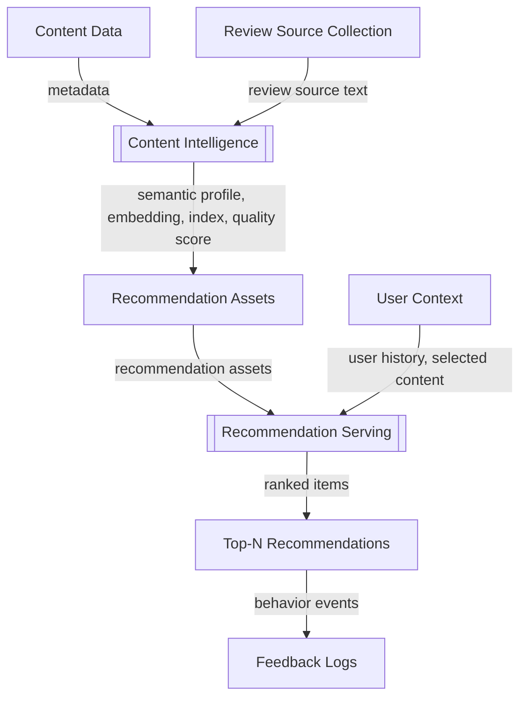
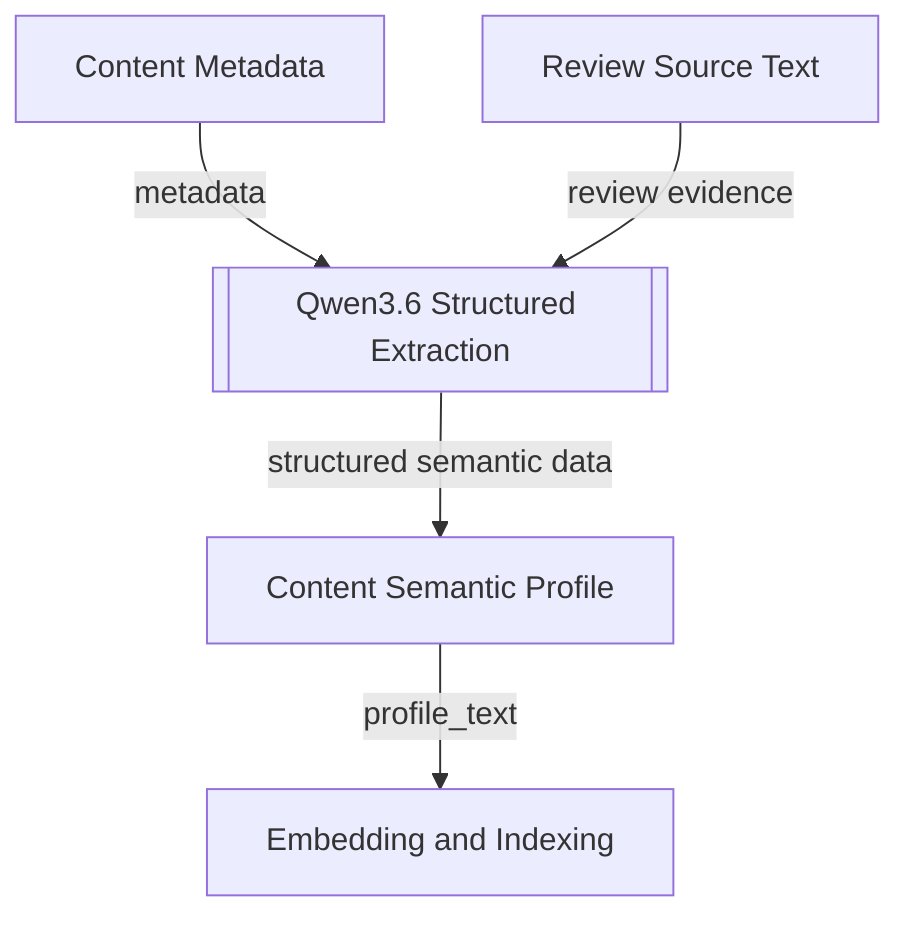
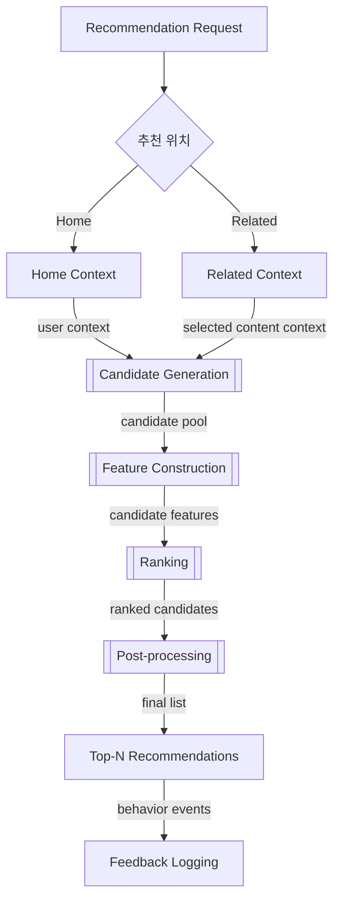

# AOD 개인화 추천 기능 개발 계획, 현재 서비스 구축 범위

## 0. 문서 범위

이 문서는 AOD에서 **현재 당장 서비스 가능한 추천 시스템**을 구축하기 위한 설계 초안이다.

| 구분 | 포함 여부 | 설명 |
|---|---:|---|
| 홈 화면 개인화 추천 | 포함 | 사용자의 기존 행동과 취향 profile을 기반으로 홈 화면 추천을 제공한다. |
| 콘텐츠 상세 페이지 추천 | 포함 | 사용자가 특정 콘텐츠를 클릭했을 때, 홈 개인화 점수와 현재 콘텐츠 유사도를 함께 반영해 추천한다. |
| 사용자 로그 수집 | 포함 | 추천 품질 분석과 향후 고도화를 위해 로그를 저장한다. |

---

## 1. 추천 목표와 적용 범위

### 1.1 추천 목표

AOD 추천의 핵심 목표는 단순한 같은 도메인 유사 추천이 아니라 **cross-domain discovery**다.

여기서 cross-domain discovery는 단순히 다른 도메인의 콘텐츠를 섞어 보여주는 것이 아니다. 사용자가 좋아할 가능성이 있는 **핵심 재미 요소, 서사 구조, 분위기, 캐릭터 매력, 세계관 감각**이 유사한 콘텐츠를 웹소설, 웹툰, 영화, TV/OTT, 게임 등 여러 도메인에 걸쳐 추천하는 것을 의미한다.

예시는 다음과 같다.

| 사용자 관심 콘텐츠 | 추천될 수 있는 콘텐츠 |
|---|---|
| 회귀, 먼치킨 웹소설 | 유사한 재미 구조를 가진 웹툰, 판타지 OTT, RPG 게임 |
| 피폐 로맨스 웹툰 | 유사한 정서의 드라마, 영화, 웹소설 |
| 다크 판타지 게임 | 유사한 세계관 감각의 웹툰, 영화, 애니메이션 |

### 1.2 추천 제공 위치

현재 구축 범위에서 추천이 노출되는 위치는 두 가지다.

| 추천 위치 | 설명 | 핵심 입력 |
|---|---|---|
| 홈 화면 | 사용자가 앱에 들어왔을 때 처음 보는 개인화 추천 영역 | user history, user fun_tag profile, user profile vector |
| 콘텐츠 상세 페이지 | 사용자가 특정 콘텐츠를 클릭했을 때 하단 또는 연관 영역에 보여주는 추천 영역 | home_score, selected content profile, selected content fun_tags |

홈 화면 추천과 콘텐츠 상세 페이지 추천은 별도의 시스템으로 분리하지 않고, 같은 추천 파이프라인을 공유한다. 차이는 최종 점수 계산에서 사용자 취향과 현재 클릭한 콘텐츠의 유사도를 각각 얼마나 강하게 반영하는지에 있다.

---

## 2. 전체 시스템 구조

### 2.1 High-level Architecture

AOD 추천 시스템은 크게 세 흐름으로 구성한다.

1. **[Content Intelligence]**  
   콘텐츠 metadata와 리뷰성 텍스트를 추천에 사용할 수 있는 `semantic profile`, `embedding`, `index`, `quality score`로 변환한다.

2. **[Recommendation Serving]**  
   사용자 context와 추천 asset을 이용해 후보를 만들고, 점수화한 뒤 최종 추천 목록을 제공한다.

3. **[Feedback Logging]**  
   추천 결과에 대한 사용자 반응을 기록한다.



이 그림은 전체 구조를 빠르게 이해하기 위한 추상화된 흐름이다. 각 block 내부의 구체적인 처리 방식은 아래 표에서 설명하고, semantic profile 생성의 상세 흐름은 4장, 추천 serving의 상세 흐름은 5장에서 설명한다.

### 2.2 Architecture Block 설명

| Block | Input | 처리 방식 | Output | 실행 시점 |
|---|---|---|---|---|
| Content Data | title, synopsis, genre, domain, platform, creator, score, rank | Content DB와 기존 크롤러에서 수집한다. | content metadata | batch |
| Review Source Collection | content title, original title, platform, domain, seed keywords | Vane 기반 search로 외부 리뷰, 커뮤니티 반응, 블로그 리뷰 등 리뷰성 텍스트를 수집한다. 이미 수집된 플랫폼 리뷰가 있으면 함께 사용한다. | review source text | batch |
| Content Intelligence | content metadata, review source text, fun_tag dictionary | Qwen3.6으로 `fun_tags`, `tag_score`, `tag_confidence`, `normalized_summary`, `profile_text`를 생성한다. `tag_score`는 모델 추정값이고, `tag_confidence`는 source와 evidence를 함께 반영한 보조 신호로 사용한다. | content semantic profile | batch |
| Embedding and Indexing | profile_text | Qwen3-Embedding-8B로 `profile_text`를 embedding하고, FAISS index를 구축한다. | embedding vector, FAISS index | batch |
| Quality Score Generation | average score, review count, platform rank, recency | Bayesian score, platform rank score, review count score, recency score를 조합해 품질 및 인기도 점수를 계산한다. | quality_popularity_score | batch 또는 주기적 갱신 |
| Recommendation Assets | content semantic profile, embedding vector, FAISS index, quality_popularity_score | Online serving에서 빠르게 조회할 수 있도록 DB와 vector index에 저장한다. | fun_tags, profile_text, embeddings, index, quality score | serving 전 준비 |
| User Context | user history, user fun_tag profile, user profile vector, selected content | 사용자의 기존 행동과 현재 클릭 콘텐츠를 추천 요청의 context로 구성한다. | request context | request-time |
| Recommendation Serving | recommendation assets, request context | candidate generation, scoring, ranking, post-processing을 거쳐 최종 추천 목록을 만든다. | Top-N recommendations | request-time |
| Feedback Logging | served items, user behavior events | impression, click, long_view, bookmark, like, hide, score_breakdown 등을 저장한다. | interaction logs | event-time |

핵심은 `Content Intelligence`가 추천 요청마다 실행되는 실시간 처리가 아니라는 점이다. 콘텐츠가 신규 등록되거나 정보가 변경되면 batch로 semantic profile과 embedding/index를 생성해 두고, 실제 추천 요청 시에는 미리 만들어둔 `Recommendation Assets`를 조회해 사용한다.

---

## 3. Main Recommendation Features

### 3.1 핵심 feature: fun_tag

AOD 추천에서 가장 중요하게 검증하고 싶은 feature는 **fun_tag**다.

fun_tag는 콘텐츠의 장르나 줄거리보다 더 직접적으로 사용자가 재미를 느끼는 요소를 표현한다.

예시는 다음과 같다.

| fun_tag | 의미 |
|---|---|
| 회귀 | 과거로 돌아가 실패를 바로잡는 구조 |
| 먼치킨 | 주인공이 압도적인 능력을 갖는 구조 |
| 사이다 | 답답한 상황을 빠르게 해소하는 전개 |
| 힘을 숨김 | 강하지만 능력을 감추고 있다가 드러내는 구조 |
| 피폐 | 정서적으로 강한 고통과 몰입을 주는 분위기 |
| 혐관 | 갈등 관계에서 감정선이 전개되는 구조 |
| 구원 서사 | 한 인물이 다른 인물을 정서적으로 구원하는 구조 |
| 잔혹한 동화 | 동화적 분위기와 잔혹한 세계관이 결합된 감각 |

fun_tag는 두 가지 역할을 한다.

| 역할 | 설명 |
|---|---|
| Candidate source | 사용자의 선호 tag 또는 현재 콘텐츠 tag와 유사한 콘텐츠를 후보로 가져온다. |
| Ranking feature | 후보 콘텐츠가 사용자 취향 또는 현재 콘텐츠의 fun_tag와 얼마나 잘 맞는지 점수화한다. |

### 3.2 fun_tag_match_score

fun_tag_match_score는 사용자 또는 현재 콘텐츠의 fun_tag와 후보 콘텐츠의 fun_tag가 얼마나 잘 맞는지를 나타내는 점수다.

직접 겹치는 tag가 있으면 높은 점수를 받을 수 있다.

```text
user_fun_tag_profile = {
  먼치킨: 0.9,
  회귀: 0.8,
  사이다: 0.7
}

candidate_fun_tags = {
  먼치킨: 0.9,
  사이다: 0.8,
  학원물: 0.5
}
```

이 경우 `먼치킨`, `사이다`가 겹치므로 fun_tag_match_score가 높아진다.

단, tag가 직접 겹치지 않는다고 해서 추천 점수가 계산되지 않는 것은 아니다. 이 경우 fun_tag_match_score는 낮거나 0에 가까워질 수 있지만, profile similarity, metadata_match_score, quality_popularity_score 등 다른 feature로 보완할 수 있다.

```text
final_score =
  w1 * fun_tag_match_score
+ w2 * profile_similarity_score
+ w3 * metadata_match_score
+ w4 * quality_popularity_score
+ w5 * recency_score
```

현재 구축 범위에서는 fun_tag를 main feature로 검증하고 싶기 때문에, 초기 weight는 fun_tag_match_score에 상대적으로 강하게 둔다.

예시:

```text
initial_score =
  0.45 * fun_tag_match_score
+ 0.25 * profile_similarity_score
+ 0.15 * quality_popularity_score
+ 0.10 * metadata_match_score
+ 0.05 * recency_score
```

위 weight는 확정값이 아니라 초기 가설이다. 실제 추천 결과 검수와 로그 분석을 통해 조정한다.

### 3.3 Supporting feature: normalized profile similarity

raw synopsis를 그대로 embedding하면 도메인별 문체와 플랫폼 홍보 문구에 영향을 많이 받을 수 있다. 그래서 추천 관점에서 정규화한 `profile_text`를 생성하고, 이 텍스트를 embedding 대상으로 사용한다.

예시:

```text
판타지 액션. 회귀, 먼치킨, 사이다 성향이 강한 콘텐츠. 주인공이 과거의 실패를 바로잡고 적을 압도하는 성장형 서사.
```

`profile_similarity_score`는 사용자 취향 vector 또는 현재 콘텐츠 profile vector와 후보 콘텐츠 profile vector의 cosine similarity로 계산한다.

### 3.4 Supporting feature: metadata_match_score

metadata_match_score는 구조화된 metadata 간 유사도를 나타낸다.

주요 입력은 다음과 같다.

| Metadata | 사용 방식 |
|---|---|
| genre | 장르 overlap 또는 장르 유사도 |
| domain | 같은 도메인 여부, cross-domain 다양성 판단 |
| platform | 사용자 플랫폼 선호와 후보 플랫폼 일치도 |
| creator | 작가, 감독, 제작사, 개발사 등 유사도 |
| age_rating | 정책 필터 및 사용자 적합성 판단 |
| release_status | 연재중, 완결, 출시 상태 반영 |

metadata_match_score는 main feature가 아니라 보조 feature다. fun_tag와 profile similarity만으로 부족한 경우, 후보의 납득 가능성을 보강하는 역할을 한다.

### 3.5 Supporting feature: quality_popularity_score

quality_popularity_score는 두 가지 역할을 한다.

| 역할 | 설명 |
|---|---|
| Candidate source | 사용자 정보가 부족하거나 후보가 부족할 때 품질과 인기도가 높은 콘텐츠를 후보로 가져온다. |
| Ranking feature | 취향 유사도가 높더라도 품질 신호가 너무 낮은 콘텐츠가 상위에 오르지 않도록 보정한다. |

평균 평점만 사용하면 리뷰 수가 적은 콘텐츠가 과대평가될 수 있다. 따라서 Bayesian score를 기본 품질 점수로 사용한다.

```text
bayesian_score =
  (v / (v + m)) * R
+ (m / (v + m)) * C
```

| Symbol | 의미 |
|---|---|
| R | 해당 콘텐츠의 평균 평점 |
| v | 해당 콘텐츠의 리뷰 수 |
| C | 전체 콘텐츠 평균 평점 |
| m | 신뢰 가능한 최소 리뷰 수 기준 |

최종 quality_popularity_score는 다음 요소를 조합한다.

```text
quality_popularity_score =
  a1 * bayesian_score
+ a2 * platform_rank_score
+ a3 * review_count_score
+ a4 * recency_score
```

---

## 4. Semantic Profile 생성

### 4.1 목적

Semantic Profile 생성의 목적은 콘텐츠를 추천에 바로 사용할 수 있는 형태로 정규화하는 것이다.

특히 AOD에서 중요한 것은 공식 콘텐츠 페이지를 다시 찾는 것이 아니라, **사용자 리뷰 또는 리뷰성 텍스트에서 실제 사용자가 느끼는 재미 요소를 추출하는 것**이다.

### 4.2 Source 수집 방향

이미 플랫폼 공식 콘텐츠 페이지 크롤링이 구현되어 있다면, Semantic Profile 생성에서 더 중요한 source는 리뷰성 텍스트다.

외부 리뷰성 텍스트 수집에는 **Vane 기반 search**를 사용한다. Vane는 공식 metadata를 다시 수집하기 위한 도구라기보다, 사용자가 실제로 콘텐츠를 어떻게 평가하고 어떤 재미 요소를 언급하는지 찾기 위한 **review source collector**로 사용한다.

| Source | 사용 목적 | 우선순위 |
|---|---|---:|
| 플랫폼 공식 콘텐츠 페이지 | 제목, 장르, 시놉시스, 작가, 플랫폼 정보 확인 | 높음, 이미 구현됨 |
| 사용자 리뷰 | 실제 사용자가 느낀 재미 요소 추출 | 매우 높음 |
| 별점과 리뷰 수 | quality_popularity_score 계산 | 높음 |
| 커뮤니티 반응, 블로그 리뷰 | fun_tag 보조 근거 | 중간 |
| 단순 위키성 정보 | 줄거리와 metadata 보조 | 낮음 |

### 4.3 Semantic Profile 생성 Flow



| Block | 의미 | 주요 데이터 |
|---|---|---|
| Content Metadata | 공식 콘텐츠 페이지와 Content DB에서 확보한 기본 정보 | title, synopsis, genre, domain, platform, creator |
| Review Source Text | Vane 기반 search 또는 보유 리뷰 데이터에서 확보한 리뷰성 텍스트 | user reviews, review summaries, community reactions |
| Qwen3.6 Structured Extraction | metadata와 리뷰 근거를 바탕으로 추천용 semantic profile을 생성하는 단계 | fun_tags, tag_score, tag_confidence, normalized_summary, profile_text |
| Content Semantic Profile | 콘텐츠별 추천용 semantic asset 저장 결과 | fun_tags, evidence, profile_text, extraction_quality |
| Embedding and Indexing | profile_text를 vector search 가능한 형태로 변환하는 단계 | embedding_vector, FAISS index |

### 4.4 Qwen3.6 Structured Extraction Output

Qwen3.6은 다음 데이터를 생성한다.

| Field | 설명 | 사용처 |
|---|---|---|
| fun_tags | 콘텐츠의 핵심 재미 tag 목록 | candidate generation, ranking |
| tag_score | Qwen3.6이 추정한 tag 강도. 해당 tag가 콘텐츠의 핵심 재미를 얼마나 강하게 설명하는지에 대한 모델 추정값이다. | fun_tag_match_score 계산에 사용하되, 절대값으로 신뢰하지 않고 후보 간 상대 비교에 사용 |
| tag_confidence | tag_score를 얼마나 신뢰할 수 있는지에 대한 보조 신호. Qwen3.6 판단만이 아니라 리뷰 근거 수, source 품질, evidence 명확성 등을 함께 반영한다. | 낮은 confidence tag 감점 또는 제외 |
| evidence | tag 추출 근거가 된 리뷰성 표현 또는 source 요약 | 검수, 디버깅 |
| normalized_summary | 추천 관점으로 정규화한 짧은 요약 | 검수, 설명, 검색 보조 |
| profile_text | embedding에 넣기 위한 추천용 텍스트 | profile embedding, FAISS |
| extraction_quality | source 품질과 추출 결과의 신뢰도 | low-quality profile 필터링 |

### 4.5 tag_score와 tag_confidence의 사용 원칙

`tag_score`는 해당 tag가 콘텐츠를 얼마나 강하게 설명하는지에 대한 **모델 추정값**이다.

예를 들어 작품의 핵심 재미가 주인공의 압도적 강함이라면 `먼치킨` tag_score가 높게 나올 수 있다.

`tag_confidence`는 그 판단을 얼마나 믿을 수 있는지에 대한 보조 신호다.

예를 들어 리뷰 여러 개에서 반복적으로 “주인공이 압도적으로 강하다”, “전개가 시원하다”는 반응이 확인되면 `먼치킨`, `사이다`의 tag_confidence가 높아진다. 반대로 리뷰가 부족하거나 source가 불명확하면 tag_score가 높아 보여도 tag_confidence는 낮게 둔다.

단, tag_score와 tag_confidence는 모두 완전한 정답 label이 아니다. 특히 tag_score는 Qwen3.6의 모델 추정값이므로 그대로 절대 점수처럼 사용하면 위험하다.

초기 서비스에서는 다음 원칙으로 사용한다.

| 원칙 | 반영 방식 |
|---|---|
| tag_score는 상대 비교에 사용 | 후보 간 fun_tag 강도를 비교하는 feature로 사용한다. |
| 낮은 tag_confidence는 약하게 반영 | confidence가 낮은 tag는 ranking 반영 강도를 낮추거나 제외한다. |
| evidence가 부족한 tag는 candidate source로 사용하지 않음 | 근거가 없는 tag가 후보 생성을 주도하지 않도록 한다. |
| source가 부족한 콘텐츠는 extraction_quality를 낮게 부여 | 추천 상위 노출을 보수적으로 처리한다. |
| 추천 결과와 사용자 반응으로 점진 보정 | offline 검수와 로그 분석을 통해 tag 품질을 조정한다. |

Qwen3.6이 생성한 tag는 정답 label이 아니라 추천을 위한 추정 feature로 사용한다. 따라서 evidence가 부족하거나 confidence가 낮은 tag는 ranking에서 약하게 반영하거나 제외한다.

---

## 5. Recommendation Serving

### 5.1 핵심 방향

홈 화면 추천과 콘텐츠 상세 페이지 추천은 같은 추천 infrastructure를 공유한다.

차이는 scoring context다.

| 추천 위치 | 핵심 기준 |
|---|---|
| 홈 화면 추천 | 사용자 취향과 후보 콘텐츠의 적합성 |
| 콘텐츠 상세 페이지 추천 | 사용자 취향 + 현재 클릭한 콘텐츠와 후보 콘텐츠의 유사성 |

콘텐츠 상세 페이지 추천을 별도 시스템으로 만들지 않고, 홈 추천 점수와 현재 콘텐츠 유사 점수를 결합한다.

```text
related_score =
  0.4 * home_score
+ 0.6 * selected_content_similarity_score
```

이 방식은 두 추천 위치를 분리 운영하는 것보다 단순하고, 동시에 현재 콘텐츠 맥락을 충분히 반영할 수 있다.

### 5.2 Serving Flow



| Block | 의미 | 주요 데이터 |
|---|---|---|
| Recommendation Request | 홈 화면 또는 콘텐츠 상세 페이지에서 추천을 요청하는 이벤트 | user_id, recommendation_location, selected_content_id optional |
| Home Context | 홈 화면 추천에 필요한 사용자 취향 맥락 | user history, user fun_tag profile, user profile vector |
| Related Context | 상세 페이지 추천에 필요한 현재 콘텐츠 맥락 | selected content profile, selected content fun_tags, home_score |
| Candidate Generation | 여러 source에서 넓은 후보 pool을 만드는 단계 | FAISS 후보, fun_tag 후보, quality 후보, metadata 후보 |
| Feature Construction | 후보별 ranking feature를 계산하는 단계 | fun_tag match, profile similarity, metadata match, quality score |
| Ranking | Home 또는 Related score로 후보를 1차 정렬하는 단계 | home_score, related_score |
| Post-processing | hard filter, soft penalty/boost, diversity re-ranking을 적용하는 단계 | adjusted_score, final candidate list |
| Top-N Recommendations | 사용자에게 노출할 최종 추천 목록 | initial Top 20, pagination items |
| Feedback Logging | 추천 노출 이후 사용자 반응을 저장하는 단계 | impression, click, long_view, like, hide |

### 5.3 Candidate Generation

Candidate generation은 사용자에게 바로 보여줄 20개를 뽑는 단계가 아니다. 넓은 후보 pool을 만드는 단계다.

예시:

| Candidate Source | 후보 수 예시 | 설명 |
|---|---:|---|
| user profile FAISS | 300 | 사용자 profile vector와 유사한 콘텐츠 |
| user fun_tag match | 300 | 사용자 fun_tag profile과 잘 맞는 콘텐츠 |
| selected content FAISS | 300 | 현재 클릭한 콘텐츠와 profile이 유사한 콘텐츠, Related에서 주로 사용 |
| selected content fun_tag match | 300 | 현재 클릭한 콘텐츠와 fun_tag가 유사한 콘텐츠, Related에서 주로 사용 |
| quality/popularity | 100 | 품질과 인기도가 높은 fallback 후보 |
| metadata similarity | 100 | 장르, creator, platform 등이 유사한 후보 |

중복 제거 후 대략 500개에서 1000개 후보 pool을 만든다.

### 5.4 Home Recommendation Score

홈 화면 추천에서는 사용자의 취향을 중심으로 점수를 계산한다.

```text
home_score =
  w1 * user_fun_tag_match_score
+ w2 * user_profile_similarity_score
+ w3 * quality_popularity_score
+ w4 * metadata_match_score
+ w5 * recency_score
```

초기 가중치는 fun_tag를 가장 강하게 둔다.

```text
home_score_initial =
  0.45 * user_fun_tag_match_score
+ 0.25 * user_profile_similarity_score
+ 0.15 * quality_popularity_score
+ 0.10 * metadata_match_score
+ 0.05 * recency_score
```

### 5.5 Content Detail Recommendation Score

콘텐츠 상세 페이지 추천에서는 사용자의 기존 취향과 현재 클릭한 콘텐츠의 유사성을 함께 본다.

```text
related_score =
  0.4 * home_score
+ 0.6 * selected_content_similarity_score
```

여기서 selected_content_similarity_score는 다음으로 계산한다.

```text
selected_content_similarity_score =
  b1 * selected_content_fun_tag_match_score
+ b2 * selected_content_profile_similarity_score
+ b3 * metadata_match_score
+ b4 * quality_popularity_score
```

즉, 상세 페이지 추천은 “이 사용자가 좋아할 만한 콘텐츠인가?”와 “방금 클릭한 콘텐츠와 비슷한 재미를 주는가?”를 동시에 반영한다.

### 5.6 Ranking and Serving

추천 serving은 다음 순서로 진행한다.

| 단계 | 설명 |
|---|---|
| 1. Candidate pool 생성 | 여러 source에서 후보를 넓게 가져온다. |
| 2. 중복 제거 | 같은 콘텐츠가 여러 source에서 들어오면 하나로 합친다. |
| 3. Feature 계산 | 각 후보마다 fun_tag, profile, metadata, quality 점수를 계산한다. |
| 4. Ranking score 계산 | Home이면 home_score, Related면 related_score를 계산한다. |
| 5. 1차 정렬 | score 기준으로 후보를 정렬한다. |
| 6. Post-processing | 정책 필터, 숨김 제외, 비선호 감점, 다양성 조정을 적용한다. |
| 7. 최종 노출 | 첫 화면에 약 20개를 보여주고, 이후 스크롤 또는 더보기에서 추가 노출한다. |

```text
candidate pool: 500~1000개
ranking 후: Top 100
post-processing 후: Top 50
initial serving: Top 20
pagination or scroll: next items
```

### 5.7 Post-processing Rules

Post-processing은 ranking score를 계산한 뒤 최종 노출 목록을 만들기 위한 단계다. 이 단계에서는 hard filter, soft penalty/boost, diversity re-ranking을 순서대로 적용한다.

적용 순서는 다음과 같다.

1. Hard filter
2. Soft penalty / boost
3. Diversity re-ranking
4. Top-N serving

#### 5.7.1 Hard filter

Hard filter는 추천 후보에서 반드시 제외해야 하는 콘텐츠를 제거하는 단계다.

| Rule | 적용 방식 | 설명 |
|---|---|---|
| policy_filter | 제외 | 연령, 정책, 플랫폼 제한에 맞지 않는 콘텐츠는 제외한다. |
| explicit_hide_filter | 제외 | 사용자가 직접 숨김 처리한 콘텐츠는 제외한다. |
| unavailable_content_filter | 제외 | 현재 서비스에서 접근 불가능한 콘텐츠는 제외한다. |

#### 5.7.2 Soft penalty / boost

Hard filter 이후 남은 후보에는 감점과 가산점을 적용한다. 감점과 가산점은 최종 점수를 과도하게 흔들지 않도록 상한을 둔다.

```text
adjusted_score =
  ranking_score
- negative_preference_penalty
- already_seen_penalty
+ recency_boost
```

| Rule | 적용 방식 | 초기 권장 범위 | 설명 |
|---|---|---:|---|
| negative_preference_penalty | 감점 | final score의 최대 15~25% | 사용자가 hide, dislike, low rating한 콘텐츠와 유사한 후보를 감점한다. |
| already_seen_penalty | 감점 또는 제외 | final score의 최대 10~30% | 이미 본 콘텐츠는 홈 추천에서는 강하게 감점하거나 제외하고, 상세 추천에서는 약하게 감점한다. |
| recency_boost | 가산점 | final score의 최대 3~8% | 신규 콘텐츠나 최근 업데이트 콘텐츠에 약한 가산점을 준다. |

negative_preference_penalty는 다음 요소를 조합해 계산한다.

```text
negative_preference_penalty =
  p1 * negative_fun_tag_overlap
+ p2 * negative_profile_similarity
+ p3 * negative_genre_overlap
```

단, negative_preference_penalty는 너무 크게 두면 추천 다양성을 해칠 수 있으므로 초기에는 final score의 20%를 넘지 않도록 제한한다.

#### 5.7.3 Diversity re-ranking

Diversity adjustment는 관련성이 낮은 콘텐츠를 억지로 올리기 위한 규칙이 아니다. ranking score가 일정 기준 이상인 후보들 안에서 특정 domain이나 platform이 과도하게 독점하지 않도록 조정하는 규칙이다.

초기 Top 20 기준 diversity rule은 다음과 같이 둔다.

| 항목 | 초기 기준 |
|---|---:|
| 하나의 domain이 차지할 수 있는 최대 비율 | Top 20의 60% 이하 |
| 하나의 platform이 차지할 수 있는 최대 비율 | Top 20의 50% 이하 |
| diversity 승격 후보의 최소 ranking score | Top 100 평균 score 이상 또는 1위 score의 70% 이상 |
| diversity 조정 대상 | Top 100 후보 안에서만 적용 |

Diversity re-ranking은 다음 순서로 적용한다.

1. ranking_score 기준으로 Top 100 후보를 만든다.
2. Top 20을 순서대로 채운다.
3. 특정 domain 또는 platform이 cap을 초과하면, 같은 domain/platform 후보는 일시적으로 skip한다.
4. skip된 자리는 score 기준을 통과한 다른 domain/platform 후보로 채운다.
5. 대체 후보의 score가 너무 낮으면 diversity를 강제로 맞추지 않는다.

Pseudo logic은 다음과 같다.

```text
final_list = []

for candidate in ranked_candidates_top_100:
    if len(final_list) == 20:
        break

    if violates_domain_cap(candidate, final_list):
        continue

    if violates_platform_cap(candidate, final_list):
        continue

    if candidate.score < minimum_quality_threshold:
        continue

    final_list.append(candidate)
```

---

## 6. User Context와 사용자 데이터 반영

### 6.1 user fun_tag profile

user fun_tag profile은 사용자가 긍정적으로 반응한 콘텐츠들의 fun_tag를 누적해서 만든 사용자 취향 profile이다.

예시:

```text
콘텐츠 A: 회귀 0.9, 먼치킨 0.8, 사이다 0.7
콘텐츠 B: 먼치킨 0.9, 힘을 숨김 0.8
콘텐츠 C: 회귀 0.7, 복수 0.8
```

이 사용자의 user fun_tag profile은 다음과 같이 만들어질 수 있다.

```text
user_fun_tag_profile = {
  먼치킨: 높음,
  회귀: 높음,
  사이다: 중간,
  힘을 숨김: 중간,
  복수: 중간
}
```

사용자 행동별 반영 강도는 다르게 둔다.

| User Action | 반영 방향 | 강도 |
|---|---|---:|
| impression only | 거의 반영하지 않음 | 매우 낮음 |
| click | 약한 positive | 낮음 |
| long_view | 중간 positive | 중간 |
| bookmark | 강한 positive | 높음 |
| like 또는 high rating | 강한 positive | 매우 높음 |
| hide 또는 dislike | negative preference | 감점 기준 |

### 6.2 user profile vector

user profile vector는 사용자가 긍정적으로 반응한 콘텐츠들의 profile embedding을 가중 평균해서 만든다.

```text
user_profile_vector =
  weighted_average(
    positive_content_embedding,
    action_weight,
    recency_weight
  )
```

이 vector는 FAISS 기반 후보 생성과 profile_similarity_score 계산에 사용한다.

### 6.3 Cold-start 전략

사용자 데이터가 부족한 경우에는 다음 전략을 사용한다.

| 사용자 기록 | 추천 전략 |
|---|---|
| 0개 | quality/popularity, platform ranking, onboarding preference |
| 1~2개 | 최근 클릭한 콘텐츠와 유사한 fun_tag/profile 기반 추천 |
| 3개 이상 | user fun_tag profile과 user profile vector 기반 추천 |
| 충분한 positive interaction | 개인화 weight 강화 |

---

## 7. Logging

현재 구축 범위에서도 로그 수집은 반드시 포함해야 한다. 로그는 당장 학습 모델을 만들기 위한 것이 아니라, 추천 품질을 검수하고 이후 고도화 가능성을 열어두기 위한 최소 기반이다.

| Log | 설명 | 사용 목적 |
|---|---|---|
| recommendation_impression | 어떤 추천이 몇 번째 위치에 노출되었는지 | 노출 대비 클릭률 계산 |
| recommendation_click | 사용자가 어떤 추천을 클릭했는지 | source와 score의 유효성 검증 |
| long_view | 클릭 후 충분히 소비했는지 | 단순 클릭보다 강한 positive signal |
| bookmark | 저장 또는 찜했는지 | 강한 positive signal |
| like 또는 rating | 명시적 선호 | user fun_tag profile 강화 |
| hide 또는 dislike | 명시적 비선호 | negative_preference_penalty 계산 |
| candidate_source | 후보가 어떤 source에서 왔는지 | source별 성능 분석 |
| score_breakdown | 각 feature 점수와 최종 score | weight 조정과 디버깅 |
| rank_position | 몇 번째로 노출되었는지 | position bias 분석 |

---

## 8. 평가 기준

### 8.1 Offline 검수 기준

서비스 적용 전에는 샘플 기반으로 추천 결과를 직접 검수한다.

| 검수 항목 | 질문 |
|---|---|
| fun_tag 적합성 | 추천 콘텐츠가 사용자 또는 현재 콘텐츠의 핵심 재미 요소와 맞는가? |
| cross-domain 납득 가능성 | 다른 도메인 콘텐츠가 억지로 섞인 것처럼 보이지 않는가? |
| 홈 추천 품질 | 사용자의 기존 취향을 잘 반영하는가? |
| 상세 페이지 추천 품질 | 현재 클릭한 콘텐츠와 실제로 관련성이 있는가? |
| 품질 보정 | 품질이 낮거나 근거가 약한 콘텐츠가 상위에 과도하게 노출되지 않는가? |
| 다양성 | 특정 도메인, 플랫폼, 장르에 과도하게 쏠리지 않는가? |
| 비선호 반영 | 사용자가 숨기거나 싫어한 콘텐츠와 유사한 후보가 과도하게 노출되지 않는가? |
| cold-start 안정성 | 사용자 기록이 부족해도 납득 가능한 추천이 나오는가? |

### 8.2 Online 지표

서비스 적용 후에는 다음 지표를 본다.

| Metric | 의미 |
|---|---|
| CTR | 추천 노출 대비 클릭률 |
| long_view_rate | 클릭 이후 충분히 소비한 비율 |
| bookmark_rate | 추천 콘텐츠를 저장한 비율 |
| like_rate | 명시적 positive 비율 |
| hide_rate | 명시적 negative 비율 |
| cross_domain_click_rate | 다른 도메인 추천이 클릭된 비율 |
| candidate_source_ctr | 후보 source별 CTR |
| score_bucket_performance | 점수 구간별 실제 반응 |

---

## 9. 검토 요청 요약

AI 추천 개발자에게 확인받고 싶은 내용은 다음이다.

1. 현재 AOD의 추천 목표를 fun_tag 중심 cross-domain discovery로 설정하는 것이 적절한가
2. 홈 추천과 상세 페이지 추천을 하나의 infrastructure에서 score만 다르게 계산하는 방향이 적절한가
3. Vane -> Qwen3.6 을 통한 리뷰 semantic 데이터 생성 파이프라인이 적절한가
4. Candidate pool을 넓게 만든 뒤 ranking과 post-processing으로 Top-N을 serving하는 구조가 적절한가
5. 현재 구축 범위에서 추가로 더 수집하면 좋은  로그가 있는가
6. 현재 방식의 평가 방법이 적절한가? 아니면 추천 모델링에서 주로 사용하는 평가 방법이 있는가?
 
