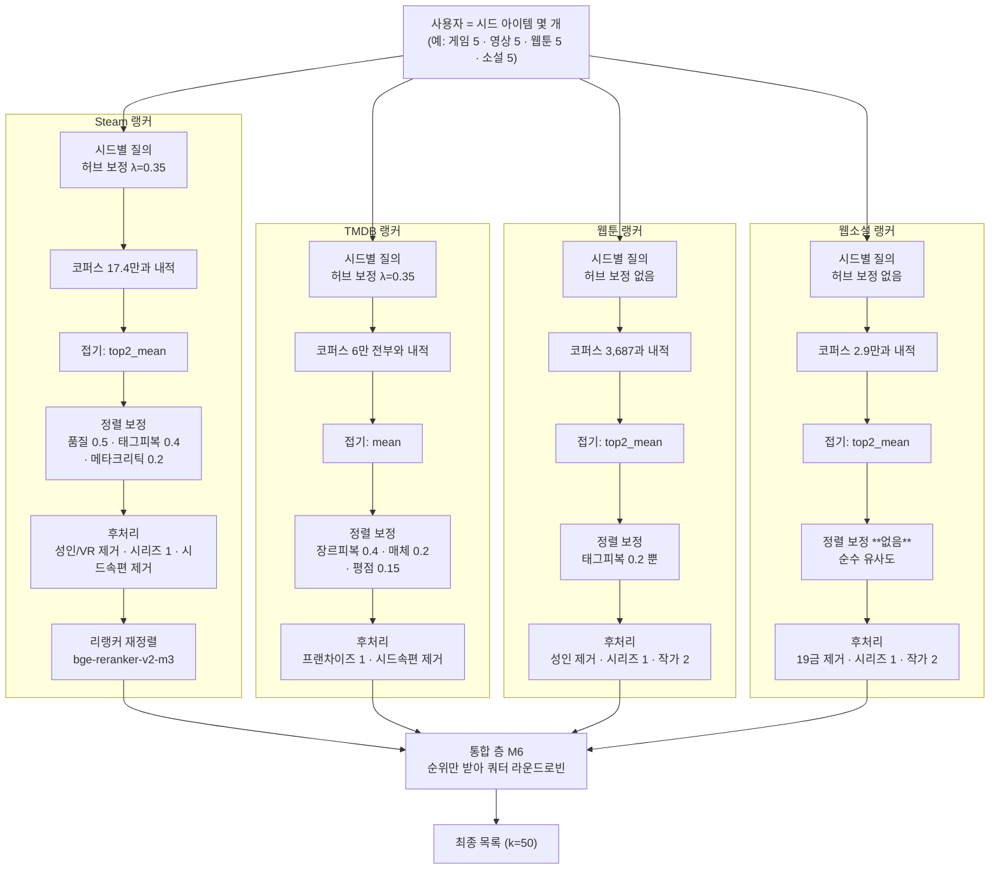
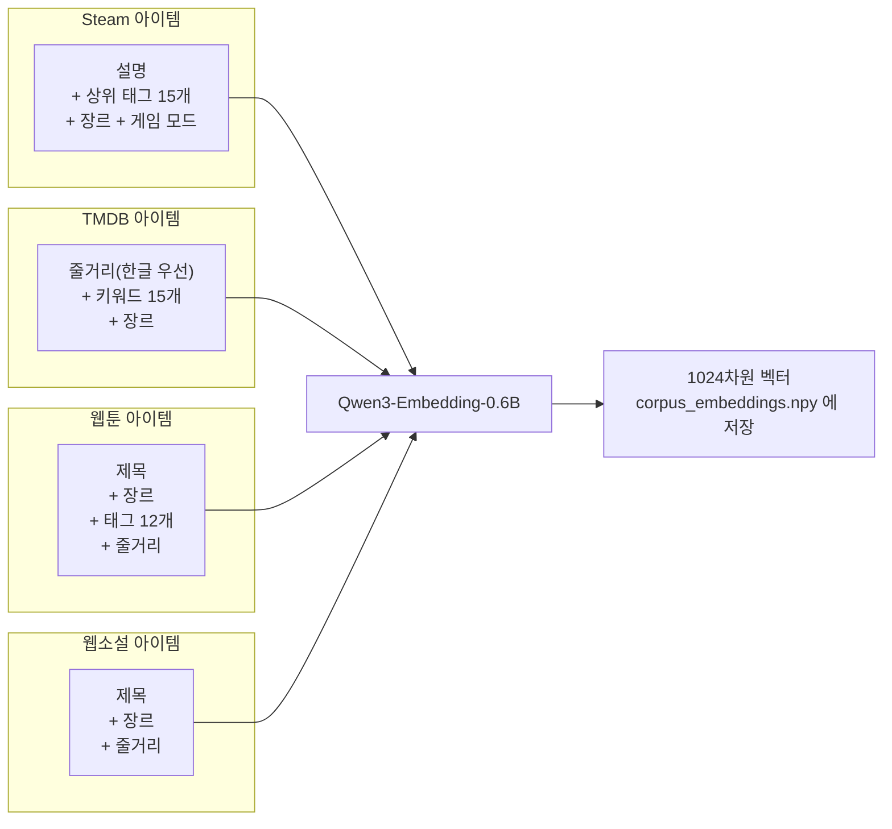
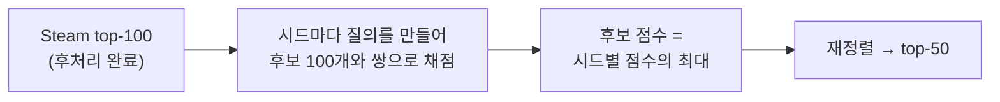
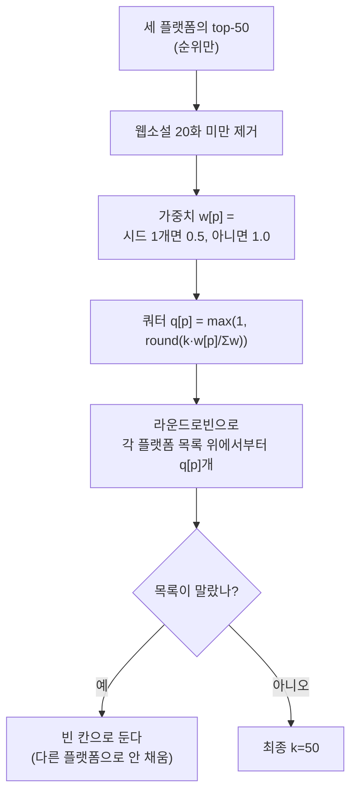
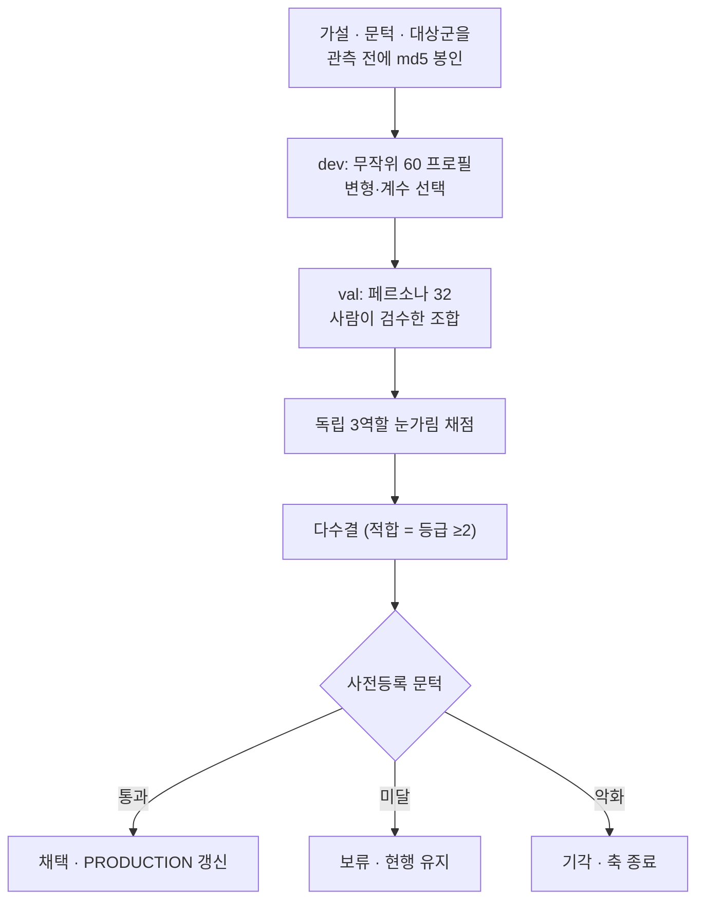

# AOD 통합 추천 — 시스템 개요

*(2026-09-12 갱신 · 코드 기준)*

Steam(게임) · TMDB(영화·드라마) · 웹툰 · 웹소설을 한 목록으로 추천한다.
네 플랫폼이 각자 순위를 내고, 통합 층이 **순위만** 받아 섞는다.

| | Steam | TMDB | 웹툰 | 웹소설 |
|---|---|---|---|---|
| 코퍼스 | 173,691 | 59,780 (**전부 서빙**) | 3,687 | 29,494 |
| 임베딩 | Qwen3-Embedding-0.6B · 1024차원 · L2 정규화 · 정확 내적(ANN 없음) | ← 동일 | ← 동일 | ← 동일 |
| 아티팩트 | `tags_full` | `tmdb_v1` | `wt_v1` | `wn_v6` |

**핵심 가설은 하나다.** 사람의 취향은 콘텐츠 의미 공간의 이웃 관계로 표현되고, 그 이웃을 임베딩
유사도로 찾을 수 있으며, 플랫폼이 달라도 같은 방법이 통한다. 협업 필터링도 학습된 랭킹 모델도 없다.
사용자는 **좋아한 작품 몇 개(시드)** 로만 표현된다. 서비스 전이라 행동 로그가 0건이기 때문이고,
그래서 이 시스템은 사실상 **콜드스타트 전용**이다.

**단일 플랫폼 성적** (독립 3역할 눈가림 채점, 라운드마다 기준선을 다시 잰다):
웹소설 0.9058(52프로필) · 웹툰 0.8567(67프로필). **라운드가 다르면 비교하지 않는다** — §8 참조.

---

## 1. 전체 흐름



> **읽는 법 — `U → S1 / T1 / W1` 화살표는 그 플랫폼에 시드가 있을 때만 생긴다.**
> 각 랭커는 자기 플랫폼 시드가 없으면 목록을 **아예 만들지 않고**, M6 은 만들어진 목록의
> 순위만 섞는다. 그래서 게임 시드만 넣으면 결과 50칸이 전부 게임이다 — **추천받고 싶은
> 플랫폼마다 시드를 따로 넣어야 한다**(X-23 실측).
> 임베딩 자체는 매체를 건너 잇는다(각색물 Recall@50 0.690). 구조가 그 신호를 안 쓰는 것이다.


핵심: **점수는 플랫폼 밖으로 나가지 않는다.** 세 랭커의 점수 스케일이 서로 달라 비교할 수 없기 때문에, 통합 층은 순위만 쓴다.

---

## 2. 무엇을 임베딩하나

아이템 하나당 텍스트 한 덩어리 → 벡터 하나. **사용자는 임베딩하지 않는다.**



**필드별 가중치는 없다.** 위 항목을 문장으로 이어 붙여 통째로 넣는다. 신호의 8할이 여기서 정해진다.

- **Steam·TMDB 는 제목을 뺀다** — 넣으면 같은 프랜차이즈끼리 뭉친다.
- **웹소설·웹툰은 제목을 넣는다** — 제목이 로그라인("회귀한 천재 검사는…")이라 정보량이 크다.
- **웹툰만 태그를 정제한다** — `완결로맨스` 같은 라벨은 장르가 아니라 연재 상태다. 그대로 두면
  "같은 장르 + 같은 연재 상태"를 재게 된다. 정지어로 뺐다(T-1, 전체 태그의 14%).
- **안 쓰는 정보**: 출시일 · 가격 · 개발사 · 리뷰 본문 · 이미지. 리뷰 수·평점은 임베딩에 안 들어가고
  정렬 보정(§4)에서만 쓴다.
- 한 번 계산해 파일로 저장한다. **서빙 때 임베딩 모델은 필요 없다** — 시드도 코퍼스 안 아이템이라 저장된 벡터를 꺼내 쓴다.

---

## 3. 시드 → 후보 (검색)


**시드 벡터를 평균내지 않는 이유** — 취향이 갈리는 사람(FPS + 농장 게임)은 평균 벡터가 아무 데도 안 가리킨다.

**전체 평균이 아니라 상위 2개인 이유** — 시드 5개 중 2개만 강하게 맞아도 그 취향 갈래를 살린다. 전체 평균이면 "다섯 개 모두와 어중간하게 비슷한 것"이 이긴다.

**허브 보정** — 고차원 임베딩에서 일부 벡터가 "모든 것과 비슷"해진다. 코퍼스 중심을 빼서 그 편향을 상쇄한다.

---

## 4. 정렬 — 유사도에 무엇을 곱하나

네 플랫폼 모두 `final = 유사도 × (1 + 보정)` 꼴. **더한 뒤 곱한다** — 보정은 배율이라, 유사도가 낮으면 아무리 인기가 많아도 못 올라온다. 더하기였다면 무관한 대작이 상위를 밀고 들어온다.

> **다만 배율이 작다는 뜻은 아니다.** 정렬 보정만 끄고 top-50 을 다시 뽑아 겹침을 재면
> **Steam 84% · TMDB 72% · 웹소설 18%** 가 바뀐다(2026-09-04 실측). 20위 아래로 유사도가
> 평평해서(Steam 은 10위→50위 낙차가 0.019 뿐) 몇 %짜리 배율이 그 구간을 통째로 다시 정렬한다.
> 즉 **Steam·TMDB 의 꼬리는 임베딩이 아니라 보정 항이 고른다.** 각 항은 채점으로 채택된 것이지만,
> 설명할 때 "의미로 찾는다"고만 말하면 그 두 플랫폼에서는 정확하지 않다.

```
Steam:  sim × (1 + 0.50·품질 + 0.40·태그피복 + 0.20·메타크리틱있음 + 0.03·추천백분위)
TMDB:   sim × (1 + 0.15·평점) × (1 + 0.40·장르피복) × (1 − 0.20·매체불일치)
웹툰:    sim × (1 + 0.20·태그피복)
웹소설:  sim × 1                      ← 보정이 하나도 없다
```

### 가중치 일람 (코드가 단일 출처: 각 플랫폼 `src/config.py` 의 `PRODUCTION`)

| 신호 | Steam | TMDB | 웹툰 | 웹소설 | 정의 |
|---|---|---|---|---|---|
| 태그·장르 피복 | **0.40** | **0.40** | **0.20** | — | `max_i \|후보 ∩ 시드ᵢ\| / \|시드ᵢ\|` |
| 리뷰 수 품질 | **0.50** | — | — | — | `clip(log10(1+리뷰)/5, 0, 1)` |
| 메타크리틱 | **0.20** | — | — | — | 점수가 아니라 **보유 여부**(0/1) |
| 평점 | — | **0.15** | 0 (T-6) | 0 (W-3) | 정규화 평점 / 별점 백분위 |
| 인기 | 0.03 (추천 백분위) | — | 0 (T-2) | **0** (W-1 철회) | 관심 수·추천 수 백분위 |
| 매체 정합 | — | **0.20 감점** | — | — | 시드 매체 집합 밖이면 `(1−w)` |
| 허브 억제 λ | **0.35** | **0.35** | 0 (T-5) | 0 | 시드에서 코퍼스 중심점을 λ만큼 뺀다 |
| 트렌드 | 0 (꺼짐) | — | — | — | 나이 코호트 초과 × 신선도 |
| 다양성 MMR | — | — | — | 0 (D-53·54 기각) | |

**Steam 은 보정 합이 최대 +113%** 다. 유사도가 두 배 넘게 뒤집힐 수 있고, 보정 지배도 84%가 여기서 나온다.
**웹소설은 정반대로 보정이 0개** 다 — 네 축을 다 재서 전부 0으로 확정했다(W-1·W-3·D-53·D-62).

### 왜 이렇게 갈렸나

- **코퍼스 크기가 47배 차이 난다**(Steam 17.4만 vs 웹툰 3,687). 허브 억제를 Steam·TMDB 만 쓰는데,
  **방향이 서로 반대라서** 같은 λ가 다른 일을 한다. Steam 은 유명작이 허브에서 밀려 있어(중앙 0.4544 vs
  Skyrim 0.4256) 중심을 빼면 유명작이 **올라온다**. TMDB 는 유명작이 허브에 더 가까워(유명 0.6456 vs
  무명 0.6151) 중심을 빼면 유명작이 **내려간다**. 웹툰은 허브가 아예 **0편**이라 뺄 게 없었다(T-5).
- **신호의 질이 같은 공식의 운명을 가른다.** 태그 피복이 웹툰에선 +0.075(편집자가 붙인 취향 라벨 10~12개),
  Steam 에선 +0.042(득표순 잡동사니 19개)다.
- **인기·평점은 네 번 재서 네 번 기각했다.** 매번 배율이 산 것은 적합률이 아니라 유명세였다
  (웹소설 0.10 에서 관심수 중앙 5.6만 → 44만, 적합률은 문턱 아래).

**피복률은 자카드가 아니다** — 후보의 추가 장르를 벌주면 시드가 균질한 프로필이 무너진다. 분모에 시드만 넣는다.

---

## 5. 후처리

| 단계 | Steam | TMDB | 웹툰 | 웹소설 |
|---|---|---|---|---|
| 하드 필터 | 성인·VR전용·출시전 제거 | 없음 (아래 참조) | 성인 제거 | 19세 이상 제거 |
| 시드 속편 | series_key + 번호 접미사 | 토큰열 포함·확장 | — | 같은 series_group |
| 중복 상한 | 시리즈 1 · 퍼블리셔 2 | 프랜차이즈 1 | 시리즈 1 · **작가 2** | 시리즈 1 · **작가 2** |
| 교차 배치 | `dominant_seed` 버킷 라운드로빈 (한 시드가 목록 독점 방지) | 〃 | 〃 | 〃 |

**후보 풀은 요청한 k 에 묶지 않는다.** 후처리가 위에서부터 걷어내므로 `max(하한, k×8)` 을 먼저
만들고 자른다(Steam·웹툰 하한 250, TMDB 400). 이 하한이 없으면 **요청 개수에 따라 상위 목록이
달라진다** — 2026-09-04 검수에서 Steam 서빙 top-20 과 평가 top-20 이 15프로필 중 7개에서 갈렸다.

**TMDB 한국어 줄거리 필터는 2026-09-12 에 껐다** (`require_korean=False`). 켜 두면 한국어 번역이
없는 26,051건이 통째로 빠지는데, 그 비용이 취향마다 완전히 달랐다 — lowvote_romance 60% ·
longtail_family 42% · coh_marvel 0%. 사실상 "유명작만 서빙" 필터였다. 빠지던 작품들은 줄거리가
**있고** 임베딩도 돼 있다. 없는 건 한글 표시문뿐이다. 대가는 화면에 영어 줄거리가 섞이는 것.

---

## 6. 리랭커 (Steam, R-1 채택)

임베딩은 후보 100개를 건져오는 데만 쓰고, 그 100개의 **순서는 크로스인코더가 다시 매긴다.**



- 모델 `BAAI/bge-reranker-v2-m3`, 점수는 **리랭커 단독**(임베딩 점수와 섞지 않음)
- 효과: Steam 슬롯 11-50위 적합률 **+0.064**, 1-10위 손상 없음
- **비용 주의**: CPU 에서 프로필당 250~450초. 품질 상한은 확인됐지만 실서빙엔 지연 최적화가 필요하다(후보 축소·양자화·부분 리랭크).
- TMDB 리랭커는 +0.035 로 문턱 미달 → 미적용.

---

## 7. 통합 층 M6



예: k=10, 시드 {Steam 1, TMDB 3, 웹소설 2} → 가중 {0.5, 1, 1} → 쿼터 {Steam 2, TMDB 4, 웹소설 4}

| 규칙 | 근거 |
|---|---|
| 웹소설 20화 미만 제거 | 통합 P@50 0.833 → 0.893. 같은 항목이 단독 0.93 인데 통합에서 0.67 이었다 |
| 시드 1개 플랫폼 가중 0.5 | 600 슬롯 채점에서 시드 1개 플랫폼 슬롯 적합률 0.42 vs 나머지 0.84 |
| 빈 칸을 안 채움 | 장르가 얇은 코퍼스는 k를 채우려다 장르 밖으로 나간다 |

---

## 8. 평가 — 숫자를 어떻게 믿나



**3역할**: A 추천 품질 평가자 / B 헤비 유저("실제로 눌러 볼까") / C 편집자("목록에 넣어도 부끄럽지 않나"). 만장일치 약 0.79~0.90.

**왜 이렇게까지 하나** — 설계자가 직접 채점한 은행이 독립 채점보다 **0.14~0.2 관대**했다(0.940 vs 0.743). 그래서 절대값은 버리고 같은 잣대 안의 차이만 쓴다.

**지키는 규칙**
- 문턱은 결과를 보고 옮기지 않는다 (웹툰 `star_boost` 가 +0.0194 로 문턱 +0.02 에 **0.0006** 모자라 기각)
- 점수를 위해 프로필·시드를 조정하지 않는다
- 한 번에 한 축만 옮긴다
- P@k 만으로는 부족 — 목록 내 유사도(ILS)를 같이 본다. 같은 걸 열 개 보여주면 P@k 가 오히려 오른다

### ⚠ 라운드 간 숫자를 나란히 놓지 않는다

T-3~T-6 의 기준선은 **같은 67개 목록**인데 합산 적합률이 0.857 / 0.833 / 0.819 / 0.827 로
**0.037 폭**을 그렸다. 차이는 슬롯 표본(RNG seed)뿐이다. 이 폭은 우리가 쓰는 채택 문턱(+0.03)과
같은 크기다. 그래서 **한 라운드 안에서 같은 슬롯을 공유하는 팔끼리만** 비교한다.

T-4 에서 이 원칙이 실제로 판정을 지켰다 — 직전 라운드 기준선을 썼다면 `max` 가 −0.031 로 보였을
것이고, 같은 라운드 안에서 재니 정확히 동률이었다.

같은 이유로 **플랫폼 간 적합률 비교도 참고용**이다. 프로필 수·코퍼스·채점 라운드가 전부 다르다.

---

## 9. 지금까지 닫은 것 · 열려 있는 것

**채택**

| 결정 | 효과 |
|---|---|
| 허브 보정 λ=0.35 | 모든 축을 동시에 올린 유일한 레버 |
| Steam 품질 항 0.50 | 0.464 → 0.769 |
| Steam 태그피복 0.40 | dev 0.793 → 0.835 |
| TMDB 장르피복 0.40 | val 0.882 → 0.917 |
| 통합 M6 | P@50 0.833 → 0.893 → 0.820 |
| **Steam 리랭커** | 11-50위 +0.064, 통합 P@50 0.778 → **0.785** |

**기각·보류 (다시 열지 않거나, 조건을 바꿔야 열리는 것)**

| 시도 | 결과 |
|---|---|
| 세 코퍼스를 한 인덱스에 (전역 정렬) | −0.146 기각 |
| 모든 시드로 모든 플랫폼 검색 (교차 시드) | −0.060 기각 — 텍스트 유사도는 *소재*를 잡지 *취향*을 못 잡는다 |
| 웹소설 규칙 태그 재표현 | 11-50 +0.007 보류 |
| TMDB 키워드 피복 | 11-50 +0.013 보류 (1-10 은 +0.046) |
| TMDB 리랭커 | 11-50 +0.035 보류 (1-10 은 +0.046) |
| 인기·평점 축 (TMDB 3회, 웹소설 2회) | 전부 기각 |

**웹툰 6축 전수 측정** (T-1~T-6, 2026-09-04) — 표현 rep_v2 +0.072 · tag_w 0.2 +0.075 채택,
pop_boost·strategy·hub_lambda·star_boost 는 현행값 유지. `star_boost 0.10` 은 +0.0194 로
채택 문턱 +0.02 에 **0.0006 모자라 기각**했다. 문턱을 관측 후에 옮기지 않는다는 규칙이 실제로 물린 사례다.

**웹소설 재판정** (W-1~W-3) — 코퍼스를 파일럿 7,062편에서 전체 29,494편으로 바꾸니 같은 설정의
top-50 이 **25%만 겹쳤다**. 확정값을 전부 다시 쟀다.

| 축 | 파일럿 결론 | 전체 코퍼스 재판정 |
|---|---|---|
| pop_boost | 0.03 채택 (D-66) | **철회 → 0** (+0.0115, 문턱 미달) |
| strategy | top2_mean | 유지 확인 |
| rating_boost | 0 (D-62) | 유지 확인 (Δ 정확히 0) |

읽을 것: **코퍼스가 바뀌면 모든 결론이 무효가 되는 게 아니라, 무너지는 것과 살아남는 것이 갈린다.**
재판정 말고는 구분할 방법이 없다. 남은 웹소설 축 `hub_lambda`·`mmr_lambda`·`min_interest_count` 는 미확인.

**남은 큰 문제 네 가지**

1. **TMDB 확정값이 지금 미확인이다** — 한국어 필터를 끄면서 후보 풀에 26,051건이 늘었다.
   네 축(D-19 hub_lambda · D-31 rating_boost · D-42 media_w · D-44 genre_w)은 전부 마스크가
   켜진 풀에서 잰 값이다. 기준선부터 다시 재야 한다.
2. **TMDB 는 머리에서만 이득이 난다** — 키워드 피복과 리랭커가 둘 다 1-10 에서 정확히 +0.046, 꼬리에서는 미달. 판정 구간을 1-10 으로 두고 다시 사전등록할 후보.
3. **웹소설 코퍼스 피복** — e스포츠·의료 같은 취향은 코퍼스에 하위 장르가 아예 없어 표현을 바꿔도 못 구한다.
4. **랭킹 시계열이 거의 없다** — 네 플랫폼 일간 스냅샷을 받지만 9/5~9/12 동안 크론이 32회 전부
   DNS 실패해 0건이었다(9/12 에 매시 재시도로 수정). 변화율·급상승 같은 랭킹 고유의 신호는
   시간축이 쌓여야 쓸 수 있다. 지금 바로 쓸 수 있는 건 **코퍼스 누락 경보** 다 —
   웹소설 today top-100 중 **24개가 코퍼스에 없다**(그것도 5·7·8·9위).

**가장 근본적인 한계** — 지금 채점은 "그럴듯한가"이지 "이 사람이 좋아하는가"가 아니다. 채점자도 LLM 이고 페르소나도 만든 것이다. 시험대(`tryout/`)에 사람 채점 3문항(**알고 있나 / 볼 의향 / 이유**)을 넣어 뒀고, 사람 채점과 LLM 채점의 일치율을 재는 것이 다음 검증이다.

그리고 더 급한 것이 **행동 데이터** 다(`PLAN_BEHAVIORAL_EVAL.md`). Steam 리뷰에서 steamid 를 긁고
보유 게임을 받아 공동보유 PMI 로 아이템-아이템 정답을 만든 뒤, **LLM 을 한 번도 안 쓰고**
현행 추천이 그걸 맞히는지 본다. 15,238/88,560 에서 멈춰 있다.

---

## 참고

- 상세 검토용 문서(코드 위치·결정 번호·열린 결함): `ARCHITECTURE.md`
- 실험 전문: `EXPERIMENT_LOG.md`, 판정문 `eval/*_verdict.md`, 사전등록 `eval/*_preregister.md`
- 시험대 실행: `tryout/run.sh` → http://localhost:8000
