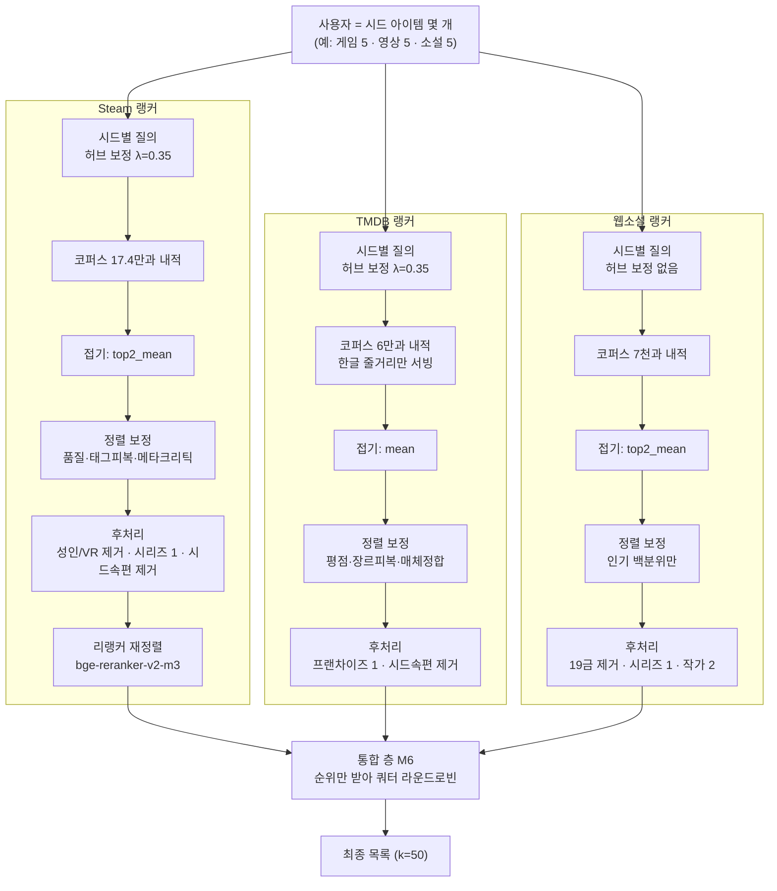
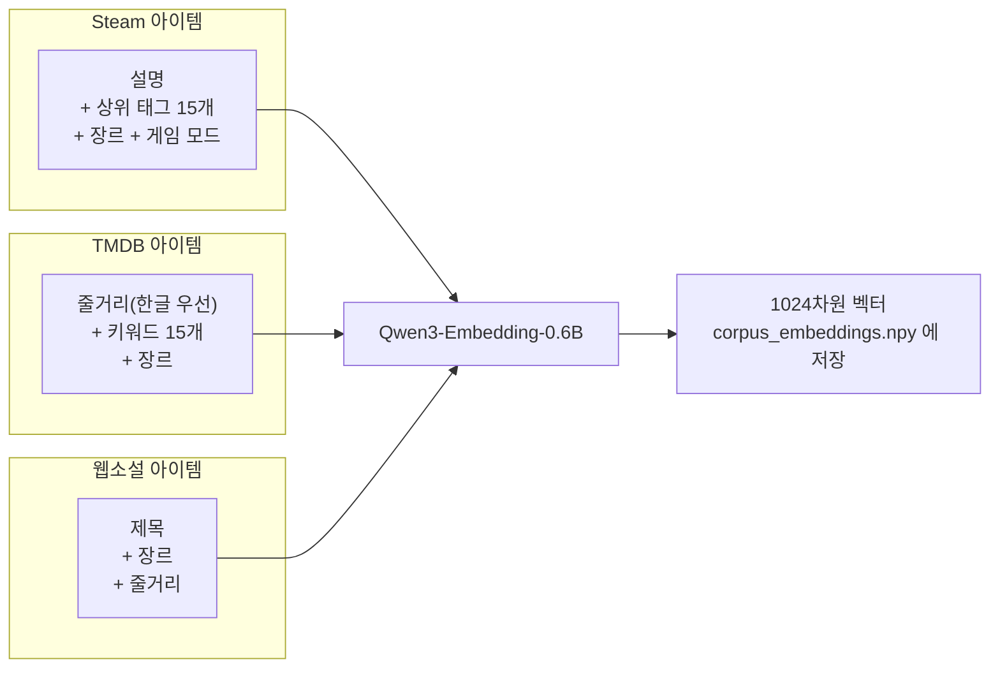
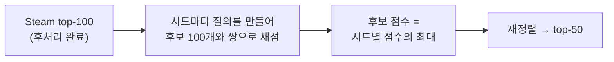
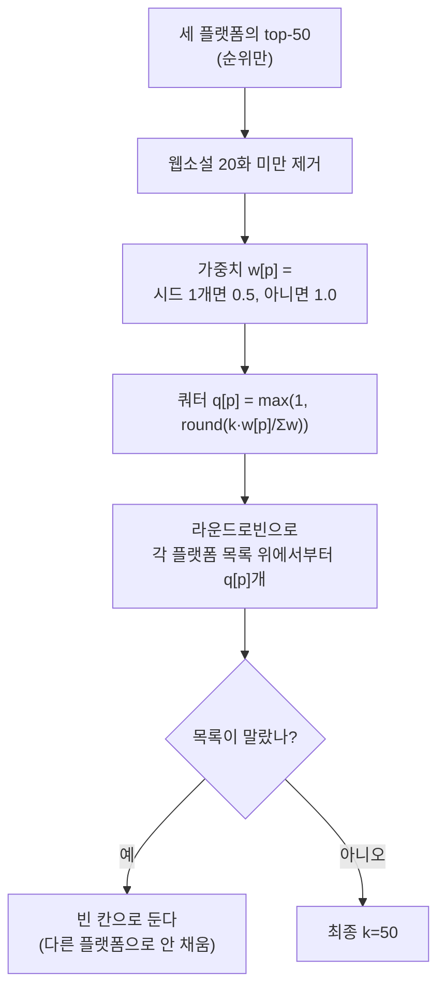
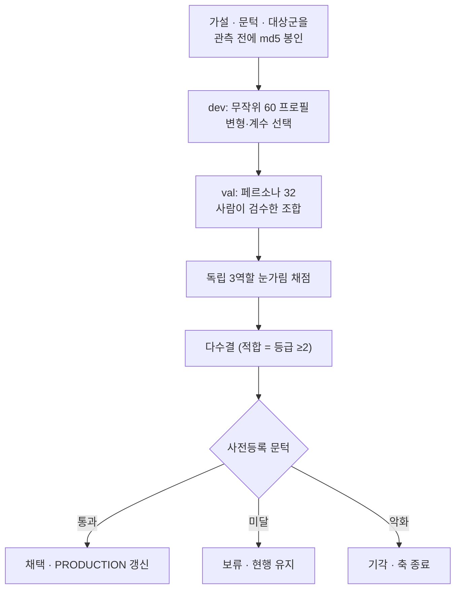

# AOD 통합 추천 — 시스템 개요

Steam(게임) · TMDB(영화·드라마) · 웹소설을 한 목록으로 추천한다.
세 플랫폼이 각자 순위를 내고, 통합 층이 **순위만** 받아 섞는다.

| | Steam | TMDB | 웹소설 |
|---|---|---|---|
| 코퍼스 | 173,691 | 59,780 (서빙 33,728) | 7,062 |
| 임베딩 | Qwen3-Embedding-0.6B · 1024차원 · L2 정규화 · 정확 내적(ANN 없음) | ← 동일 | ← 동일 |

현재 성적(독립 3역할 눈가림 채점, 페르소나 32): **P@10 0.872 · P@50 0.785**

---

## 1. 전체 흐름



> **읽는 법 — `U → S1 / T1 / W1` 화살표는 그 플랫폼에 시드가 있을 때만 생긴다.**
> 각 랭커는 자기 플랫폼 시드가 없으면 목록을 **아예 만들지 않고**, M6 은 만들어진 목록의
> 순위만 섞는다. 그래서 게임 시드만 넣으면 결과 50칸이 전부 게임이다 — **추천받고 싶은
> 플랫폼마다 시드를 따로 넣어야 한다**(X-23 실측).
> 임베딩 자체는 매체를 건너 잇는다(각색물 Recall@50 0.690). 구조가 그 신호를 안 쓰는 것이다.


핵심: **점수는 플랫폼 밖으로 나가지 않는다.** 세 랭커의 점수 스케일이 서로 달라 비교할 수 없기 때문에, 통합 층은 순위만 쓴다.

---

## 2. 무엇을 임베딩하나

아이템 하나당 텍스트 한 덩어리 → 벡터 하나. **사용자는 임베딩하지 않는다.**



- **Steam·TMDB 는 제목을 뺀다** — 넣으면 같은 프랜차이즈끼리 뭉친다.
- **웹소설은 제목을 넣는다** — 웹소설 제목은 로그라인("회귀한 천재 검사는…")이라 정보량이 크다.
- 한 번 계산해 파일로 저장한다. **서빙 때 임베딩 모델은 필요 없다** — 시드도 코퍼스 안 아이템이라 저장된 벡터를 꺼내 쓴다.

---

## 3. 시드 → 후보 (검색)


**시드 벡터를 평균내지 않는 이유** — 취향이 갈리는 사람(FPS + 농장 게임)은 평균 벡터가 아무 데도 안 가리킨다.

**전체 평균이 아니라 상위 2개인 이유** — 시드 5개 중 2개만 강하게 맞아도 그 취향 갈래를 살린다. 전체 평균이면 "다섯 개 모두와 어중간하게 비슷한 것"이 이긴다.

**허브 보정** — 고차원 임베딩에서 일부 벡터가 "모든 것과 비슷"해진다. 코퍼스 중심을 빼서 그 편향을 상쇄한다.

---

## 4. 정렬 — 유사도에 무엇을 곱하나

세 플랫폼 모두 `final = 유사도 × (1 + 보정)` 꼴. **더한 뒤 곱한다** — 보정은 배율이라, 유사도가 낮으면 아무리 인기가 많아도 못 올라온다. 더하기였다면 무관한 대작이 상위를 밀고 들어온다.

> **다만 배율이 작다는 뜻은 아니다.** 정렬 보정만 끄고 top-50 을 다시 뽑아 겹침을 재면
> **Steam 84% · TMDB 72% · 웹소설 18%** 가 바뀐다(2026-09-04 실측). 20위 아래로 유사도가
> 평평해서(Steam 은 10위→50위 낙차가 0.019 뿐) 몇 %짜리 배율이 그 구간을 통째로 다시 정렬한다.
> 즉 **Steam·TMDB 의 꼬리는 임베딩이 아니라 보정 항이 고른다.** 각 항은 채점으로 채택된 것이지만,
> 설명할 때 "의미로 찾는다"고만 말하면 그 두 플랫폼에서는 정확하지 않다.

```
Steam:  sim × (1 + 0.50·품질 + 0.40·태그피복 + 0.20·메타크리틱있음 + 0.03·리뷰백분위)
TMDB:   sim × (1 + 0.15·평점) × (1 + 0.40·장르피복) × (1 − 0.20·매체불일치)
웹소설:  sim × (1 + 0.03·인기백분위)
```

| 항 | 정의 | 왜 |
|---|---|---|
| 품질 | `clip(log10(1+리뷰수)/5, 0, 1)` | 저품질 롱테일이 상위 침범 |
| 태그·장르 피복 | `max_i \|후보태그 ∩ 시드ᵢ태그\| / \|시드ᵢ태그\|` | 20위 아래 유사도가 평평해지는 구간을 가른다 |
| 메타크리틱 | 점수가 아니라 **존재 여부** | 존재 상관 +0.131 vs 점수 +0.060 |
| 인기 백분위 | 관심 수 순위 | 웹소설은 품질 신호를 하나도 못 찾음 |

**피복률은 자카드가 아니다** — 후보의 추가 장르를 벌주면 시드가 균질한 프로필이 무너진다. 분모에 시드만 넣는다.

---

## 5. 후처리

| 단계 | Steam | TMDB | 웹소설 |
|---|---|---|---|
| 하드 필터 | 성인·VR전용·출시전 제거 | (한글 줄거리 — 검색 단계) | 19세 이상 제거 |
| 시드 속편 | series_key + 번호 접미사 | 토큰열 포함·확장 | 같은 series_group |
| 중복 상한 | 시리즈 1 · 퍼블리셔 2 | 프랜차이즈 1 | 시리즈 1 · **작가 2** |
| 교차 배치 | `dominant_seed` 버킷 라운드로빈 (한 시드가 목록 독점 방지) | 〃 | 〃 |

---

## 6. 리랭커 (Steam, R-1 채택)

임베딩은 후보 100개를 건져오는 데만 쓰고, 그 100개의 **순서는 크로스인코더가 다시 매긴다.**



- 모델 `BAAI/bge-reranker-v2-m3`, 점수는 **리랭커 단독**(임베딩 점수와 섞지 않음)
- 효과: Steam 슬롯 11-50위 적합률 **+0.064**, 1-10위 손상 없음
- **비용 주의**: CPU 에서 프로필당 250~450초. 품질 상한은 확인됐지만 실서빙엔 지연 최적화가 필요하다(후보 축소·양자화·부분 리랭크).
- TMDB 리랭커는 +0.035 로 문턱 미달 → 미적용.

---

## 7. 통합 층 M6



예: k=10, 시드 {Steam 1, TMDB 3, 웹소설 2} → 가중 {0.5, 1, 1} → 쿼터 {Steam 2, TMDB 4, 웹소설 4}

| 규칙 | 근거 |
|---|---|
| 웹소설 20화 미만 제거 | 통합 P@50 0.833 → 0.893. 같은 항목이 단독 0.93 인데 통합에서 0.67 이었다 |
| 시드 1개 플랫폼 가중 0.5 | 600 슬롯 채점에서 시드 1개 플랫폼 슬롯 적합률 0.42 vs 나머지 0.84 |
| 빈 칸을 안 채움 | 장르가 얇은 코퍼스는 k를 채우려다 장르 밖으로 나간다 |

---

## 8. 평가 — 숫자를 어떻게 믿나



**3역할**: A 추천 품질 평가자 / B 헤비 유저("실제로 눌러 볼까") / C 편집자("목록에 넣어도 부끄럽지 않나"). 만장일치 약 0.79~0.90.

**왜 이렇게까지 하나** — 설계자가 직접 채점한 은행이 독립 채점보다 **0.14~0.2 관대**했다(0.940 vs 0.743). 그래서 절대값은 버리고 같은 잣대 안의 차이만 쓴다.

**지키는 규칙**
- 문턱은 결과를 보고 옮기지 않는다 (한 실험은 +0.016 으로 문턱 +0.02 에 0.004 모자라 기각했다)
- 점수를 위해 프로필·시드를 조정하지 않는다
- 한 번에 한 축만 옮긴다
- P@k 만으로는 부족 — 목록 내 유사도(ILS)를 같이 본다. 같은 걸 열 개 보여주면 P@k 가 오히려 오른다

---

## 9. 지금까지 닫은 것 · 열려 있는 것

**채택**

| 결정 | 효과 |
|---|---|
| 허브 보정 λ=0.35 | 모든 축을 동시에 올린 유일한 레버 |
| Steam 품질 항 0.50 | 0.464 → 0.769 |
| Steam 태그피복 0.40 | dev 0.793 → 0.835 |
| TMDB 장르피복 0.40 | val 0.882 → 0.917 |
| 통합 M6 | P@50 0.833 → 0.893 → 0.820 |
| **Steam 리랭커** | 11-50위 +0.064, 통합 P@50 0.778 → **0.785** |

**기각·보류 (다시 열지 않거나, 조건을 바꿔야 열리는 것)**

| 시도 | 결과 |
|---|---|
| 세 코퍼스를 한 인덱스에 (전역 정렬) | −0.146 기각 |
| 모든 시드로 모든 플랫폼 검색 (교차 시드) | −0.060 기각 — 텍스트 유사도는 *소재*를 잡지 *취향*을 못 잡는다 |
| 웹소설 규칙 태그 재표현 | 11-50 +0.007 보류 |
| TMDB 키워드 피복 | 11-50 +0.013 보류 (1-10 은 +0.046) |
| TMDB 리랭커 | 11-50 +0.035 보류 (1-10 은 +0.046) |
| 인기·평점 축 (TMDB 3회, 웹소설 2회) | 전부 기각 |

**남은 큰 문제 두 가지**

1. **TMDB 는 머리에서만 이득이 난다** — 키워드 피복과 리랭커가 둘 다 1-10 에서 정확히 +0.046, 꼬리에서는 미달. 판정 구간을 1-10 으로 두고 다시 사전등록할 후보.
2. **웹소설 코퍼스 피복** — e스포츠·의료 같은 취향은 코퍼스에 하위 장르가 아예 없어 표현을 바꿔도 못 구한다.

**가장 근본적인 한계** — 지금 채점은 "그럴듯한가"이지 "이 사람이 좋아하는가"가 아니다. 채점자도 LLM 이고 페르소나도 만든 것이다. 시험대(`tryout/`)에 사람 채점 3문항(**알고 있나 / 볼 의향 / 이유**)을 넣어 뒀고, 사람 채점과 LLM 채점의 일치율을 재는 것이 다음 검증이다.

---

## 참고

- 상세 검토용 문서(코드 위치·결정 번호·열린 결함): `ARCHITECTURE.md`
- 실험 전문: `EXPERIMENT_LOG.md`, 판정문 `eval/*_verdict.md`, 사전등록 `eval/*_preregister.md`
- 시험대 실행: `tryout/run.sh` → http://localhost:8000
